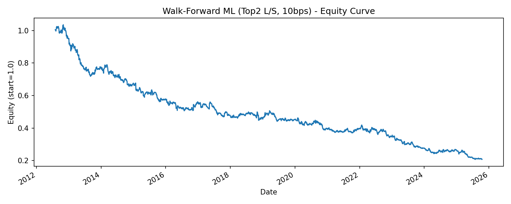
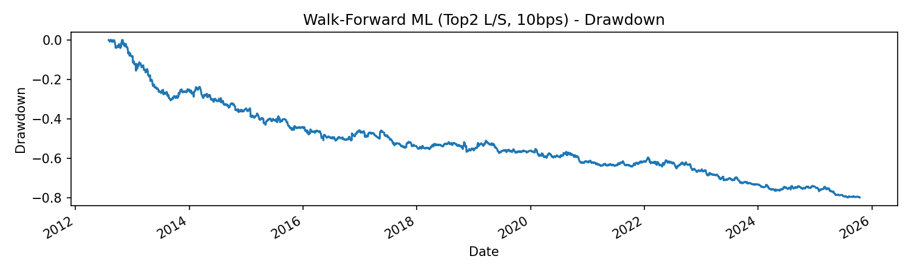

# Walk-Forward ML for Short-Horizon Equity Signals

**Goal:** Demonstrate a realistic, leakage-safe ML pipeline for short-horizon equity signals, including walk-forward training, portfolio construction with costs, and performance reporting. This was done to gain experience applying machine learning in a quantitative finance context.

**Next Steps:** Currently, I have a robust walk forward ML pipeline, with portfolio construction and realistic backtesting which includes costs - satisfying the goal of this project of building a machine learning model in a quantitative finance context. 

The strategy itself, using a daily horizon and simple features, is currently unprofitable but this code is structured for iteration. Future steps to create an edge could include:
- Predicting excess returns (above eg. SNP500) instead of raw returns. 
- Increasing label horizon to boost signal to noise ratio. 
- Reducing transaction costs by smoothing weights or trading less frequently.

## Highlights
- **Leakage control:** Strict time-ordered splits, labels shifted to predict **t→t+1**.
- **Walk-forward retraining:** Expanding window, monthly by default.
- **Features:** Momentum, mean reversion, volatility (ATR/realized), RSI, volume z-scores.
- **Portfolio:** Top-N long / bottom-N short, caps gross leverage, transaction costs.
- **Reporting:** Equity curve, drawdown, yearly Sharpe/CAGR, turnover.

